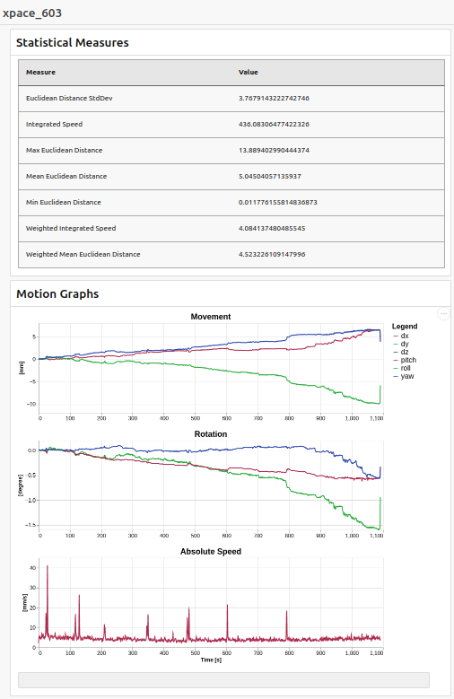

# XPace Tools

Tools for working with XPace logfiles which contain motion-traces of subject movement happening during an MRI scan.
The files are named `xpace_xxx.log` where `xxx` is a sequentially increasing number, the highest of which denotes 
the most recent scan.
XPace log files contain the motion a dedicated marker underwent during scanning in the scanner’s co-ordinate system.

This software contains

1. a parser for loading and understanding the XPace logfiles
2. math functions to, e.g. transform motion traces into scanner coordinates
3. a tool to calculate statistics based on logfiles and create visualization

## Usage

The main goal was to provide a program `xpaceStatistics` that runs without any (serious) dependencies on most machines
and calculates a statistic of XPace logfiles.
In genereral, the usage is

```shell
xpaceStatistics xpace_001.log
```

but you can use `--help` to see further options.
The program attempts to read the logfile and provide 3 files:

```shell
xpace_603_stats.json
xpace_603_motion.json
xpace_603.html
```

- The `stats` file contains statistical measures that give a summarized overview of the motions.
- The `motions` file contains positions, angles and movement-speed for each measured data-point. The values are in scanner coordinates.
- The `html` file is a page that shows both a table with the statistical measures and graphs of the motion



## Development


This software is written in C++17, needs CMake version >= 3.15 and relies on the [Boost library](https://www.boost.org/) 
version >= 1.71.
It relies on two other (header-only) libraries that are automatically loaded into the CMake project:

- The [JSON library of Niels Lohmann](https://github.com/nlohmann/json)
- The [CTML library of Maxwell Flynn](https://github.com/tinfoilboy/CTML), a C++ HTML document constructor

### Compilation

Clone the repository, make sure you have cmake version 3.15 or later and either open it in CLion. On the commandline,
follow this:

```shell script
cd XPaceTools
mkdir build
cd build

cmake -DBOOST_ROOT=/your/path/to/boost_1_71_0 ..
make
```