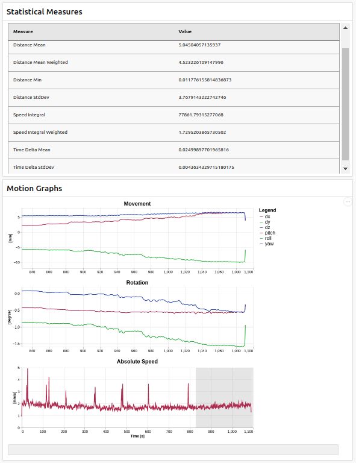

# XPace Tools

Tools for working with XPace logfiles which contain motion-traces of subject movement happening during an MRI scan. The
files are named `xpace_xxx.log` where `xxx` is a sequentially increasing number, the highest of which denotes the most
recent scan. XPace log files contain the motion a dedicated marker underwent during scanning in the scanner’s
co-ordinate system.

This software contains

1. a parser for loading and understanding the XPace logfiles
2. math functions to, e.g. transform motion traces into scanner coordinates
3. a tool to calculate statistics based on logfiles and create visualization

## Usage

The main goal was to provide a program `xpaceStatistics` that runs without any (serious) dependencies on most machines
and calculates a statistic of XPace logfiles. In general, the usage is

```shell
xpaceStatistics xpace_001.log
```

but you can use `--help` to see further options. The program attempts to read the logfile and provide 3 files:

```shell
xpace_603_stats.json
xpace_603_motion.json
xpace_603.html
```

- The `stats` file contains statistical measures that give a summarized overview of the motions.
- The `motions` file contains positions, angles and movement-speed for each measured data-point. The values are in
  scanner coordinates.
- The `html` file is a page that shows both a table with the statistical measures and graphs of the motion



### Background and details about provided statistic measures

At the beginning of the measurement, the PMC system captures the initial position of the marker. During the scan,
relative movements of the marker are continuously captured and stored with a time- and frame-stamp.

During processing, the first step is to calculate the relative motion (translation and rotation) in scanner-coordinates
for each time-step. This is an indication of how much the subject moved from the initial position. From these
observations, the following measures are calculated:

- Euclidean distance from the initial position. As described in [this article][1], the Euler-angles are taken into
  account into this distance. For the list of distances, the mean, min, max, and standard-deviation are calculated.
- Using the motion, a "speed" measure is defined that also takes translations and rotations into account. For the speed,
  the sum (integral) is given. When variance measures turn out to be of value, they will be implemented in the future.
- For distance and speed measures, there is a "weighted" variant available that puts more weight in the center of the
  measurement because this is the region where the center of the k-space is captured.
- Sometimes frames are skipped due to invalid measurements. That also might be important information. Therefore, the
  mean time-difference and its standard-deviation is also included.
  
These measures are shown in the HTML file and are also available in a dedicated `xxx_stats.json`:

```json
{
  "Distance Max": 13.889402990444374,
  "Distance Mean": 5.04504057135937,
  "Distance Mean Weighted": 4.523226109147996,
  "Distance Min": 0.011776155814836873,
  "Distance StdDev": 3.7679143222742746,
  "Speed Integral": 77861.79315277068,
  "Speed Integral Weighted": 1.7295203865730502,
  "Time Delta Mean": 0.02499897701965816,
  "Time Delta StdDev": 0.0043634329715180175
}
```

In addition to these summarized measures, the calculated motion and speed values for each time-step are available
in a separate `xxx_motion.json` file that can be investigated with tools like Mathematica (or Matlab if you must).

[1]:  https://www.sciencedirect.com/science/article/pii/S1053811915001925

## Development

This software is written in C++17, needs CMake version >= 3.15 and relies on the [Boost library](https://www.boost.org/) and
two other (header-only) libraries:

- The [JSON library of Niels Lohmann](https://github.com/nlohmann/json)
- The [CTML library of Maxwell Flynn](https://github.com/tinfoilboy/CTML), a C++ HTML document constructor

The two libraries above are loaded automatically from their respective GitHub repository during the CMake configuration
step.

### Building Boost Locally

Download [Boost version 1.85](https://www.boost.org/) and build it by first calling `./bootstrap.sh` and then

```shell
./b2 --prefix=/your/boost/install/path \
  --build-type=complete \
  --layout=versioned \
  variant=release \
  link=static \
  threading=multi \
  runtime-link=static \
  install
```

### Compilation

Clone the repository, make sure you have cmake version 3.15 or later and either open it in CLion. On the commandline,
follow this:

```shell script
cd XPaceTools
mkdir build
cd build

cmake -DBOOST_ROOT="/your/boost/install/path" ..
make
```